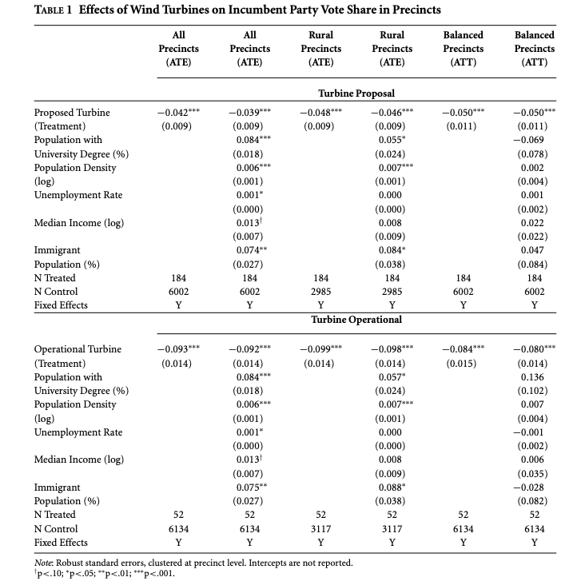

### Abstract

Stokes (2015) finds that voters do pay attention to climate policy and afterwards penalize the incumbent governments for facilities viewed as harmful to the communities. I successfullly replicated Stokes' results. In my replication, I tested the strength of Stokes' model using a Bayesian regression model. Contrary to Stokes' findings, I found that on average, voters were more likely to support the incumbent governments.

### Introduction

Stokes (2015) uses data that from 26 districts in Ontario, Canada where renewable wind projects were proposed or operational to determine whether people living near wind turbines vote against incumbent governments to punish them for climate policy regarding incentives for infrastructure in their local communities (Stokes 2015). During Onatrio's 2003 election, the Liberal Party bid with a plan to exhaust coal usage. After winning the election and having eight years of power, the Liberals implemented a "feed-in-tariff" policy which aimed to remove coal usage, reduce greenhouse emissions, and boost job opportunities within the provinces (Stokes 2015). They focused the policy around the use of wind energy development and provided substantial returns on investment and many company began to opt-in to develop wind projects in areas with high wind resources, all of which excluded the communities' input on whether they desired to receive the structures (Stokes 2015). The data collected is from the 2003, 2007, and 2011 elections, marking the Liberal Party's beginning of power to them losing majority (Stokes 2015). To ensure the robustness of her model, Stokes utilized a fixed effect estimator, which relies on variation of a unit to indentify causal effects, and a instrumental variable estimator, which relies on cross-sectional comparison to check the fixed effects results (Stokes 2015). The fixed effect estimator was proximity to proposed or operation wind turbine structures and the instrumental variable estimator was wind power. The results of linear regression ran by Stokes show that voters retrospectively punished incumbent governments for facilites viewed as harmful to the communities and that proximity to wind turbines leads them to oppose the development of projects (Stokes 2015). In addition, Stokes that communities were mobilized to vote against proposals, which accounts for the change in the Liberal Party's vote share, and that the voters were informed about climate change due to only punishing incumbent governments to which were responsible for new policies (Stokes 2015).  

The first piece of this paper was a replication of Stokes' results. Here code and data are publically available on the Harvard Dataverse. In order to replicate her results, I ran her orignial code using R code. I was easily able to run the code for both the tables and figures, but the code for formatting the tables in LaTex was not provided on Dataverse. I also was unable to create Figure 1, as code was also not provided. Instead, I opted to analyze the raw output of the regressions from my replications. All code for the replication is available in my GitHub repository.

After the replication, in my extension of Stoke's work I test the strength of Stokes' model by running a Bayesian regression upon it. In order to perform this treatment effect, I created a new variable named "effect" that is deprived from "perc_lib". According to Stokes' codebook, "perc_lib" represents the votes cast for the Liberal Party divided by the number of voters who cast ballots in the precinct. In other words, "perc_lib" is equivalent to vote share. If the vote share is greater than 0, it is equal to 1 in "vote". If the vote share is less than 0, it is equal to 0 in "vote". I then replaced Stokes' linear regressions with Bayesian ones and replaced "perc_lib" with "vote". This design is used to predict the probability of voting for the incumbent. 

The results of figures and tables using stan_glm() outputs revealed that Stokes' models may not have been as robust as she had anticipated. I discovered that voters were more likely to support incumbent governments retrospectively from wind turbine implementation. These results clash with Stokes' findings. This may be due to clustering not being utilized in my models. This extension therefore creates more questions surrounding climate policy implementation and incumbent voter support.

Throughout this paper, I will investigate Stokes' paper through literature review, discussion of the replication, and an in-depth analysis of my extension. 

### Literature Review


```{r setup, include=FALSE}

# I set include = FALSE because I don't want this to appear on my pdf.

knitr::opts_chunk$set(echo = FALSE)

# I set this equal to false because I don't want it to appear on my pdf.

library(foreign)
library(lmtest)
library(sandwich)
library(Matching)
library(ebal)
library(memisc)
library(ggplot2)
library(sp)
library(maptools) 
library(rgdal) 
library(rgeos)
library(AER)
library(plyr)
library(scales) 
library(RColorBrewer)
library(rstanarm)
library(bookdown)
library(dplyr)

# These are the libraries needed for the replications of Stokes' data and for my
# extension.

```

### Extension

```{r reading in data, include = FALSE}

# I set include = FALSE because I don't want this to appear on my pdf.

divisions <-
  read.csv(
    "replication_file.csv",
    stringsAsFactors = FALSE,
    na.strings = c("NA", ""),
    strip.white = TRUE
  )

# This is code from the replication on feeding in the dataset. 

divisions$poll_id_07 <- as.factor(divisions$poll_id_07) 

divisions$master_id <- as.factor(divisions$master_id)

divisions$poll_id_03 <- as.factor(divisions$poll_id_03)

divisions$fed_id <- as.factor(divisions$fed_id)

# This is code from the replication. Several variables need to be factors to
# ensure the functions that Stokes created run properly.

```

```{r demeaner function, include=FALSE}

# I set include = FALSE because I don't want this to appear on my pdf.

# This is code for one of many of Stokes' functions from the replication code
# and her code comments. This function is necessary for my extension.

demeaner <- function(yx, T, group, w = NULL) {
  conds <- length(levels(T))
  n <- length(T)
  Td = as.data.frame(model.matrix( ~ T - 1, model.frame( ~ T - 1), contrasts =
                                     FALSE)[1:n, 1:conds])
  colnames(Td) <-
    paste("Y", levels(T)[1:conds], sep = "") 
  
# This puts a Y in front of the year/time variable so they are character
# strings.
  
  yx <- cbind(yx, Td)
  
  yx2 <-
    matrix(NA, nrow = nrow(yx), ncol = ncol(yx)) 
  
# This is a big empty matrix we will fill.
  
  group <- droplevels(group)
  
  for (c in levels(group)) {
    yx.c <- as.matrix(yx[group == c, ], ncol = ncol(yx))
    if (is.null(w)) {
      yx2[group == c, ] <-
        yx.c - matrix(rep(colMeans(yx.c), times = nrow(yx.c)),
                      ncol = ncol(yx.c),
                      byrow = TRUE)
    } else {
      yx2[group == c, ] <-
        yx.c - matrix(rep(apply(yx.c, 2, weighted.mean, w = weights), times = nrow(yx.c)),
                      ncol = ncol(yx.c),
                      byrow = TRUE)
    }
  }
  
  colnames(yx2) <- colnames(yx)
  
  yx2 = as.data.frame(yx2)
  return(yx2)
}

```

```{r missing data, include = FALSE}

# I set include = FALSE because I don't want this to appear on my pdf.

# This code is a part of Stokes' replication and her code comments.

dt <- divisions

length(which(is.na(dt$log_pop))) / nrow(dt) #1%

length(which(is.na(dt$log_pop_denc))) / nrow(dt) #1%

length(which(is.na(dt$log_median_inc))) / nrow(dt) #4%

length(which(is.na(dt$avg_home_val_log))) / nrow(dt) #3%

length(which(is.na(dt$unemploy_rate))) / nrow(dt) #3%

length(which(is.na(dt$p_uni_degree))) / nrow(dt) #2%

length(which(is.na(dt$p_immigrant))) / nrow(dt) #2%

length(which(is.na(dt$p_housing_own))) / nrow(dt) #2%

# The above show the lengths.

d2007 <- dt[which(dt$year == 2007),]

d2011 <- dt[which(dt$year == 2011),]

d2003 <- dt[which(dt$year == 2003),]

# The above subset the data by year.

d2007$log_pop_denc[which(is.na(d2007$log_pop_denc))] <-
  mean(d2007$log_pop_denc, na.rm = T)

d2007$log_pop[which(is.na(d2007$log_pop))] <-
  mean(d2007$log_pop, na.rm = T)

d2007$log_median_inc[which(is.na(d2007$log_median_inc))] <-
  mean(d2007$log_median_inc, na.rm = T)

d2007$avg_home_val_log[which(is.na(d2007$avg_home_val_log))] <-
  mean(d2007$avg_home_val_log, na.rm = T)

d2007$avg_home_val[which(is.na(d2007$avg_home_val))] <-
  mean(d2007$avg_home_val, na.rm = T)

d2007$unemploy_rate[which(is.na(d2007$unemploy_rate))] <-
  mean(d2007$unemploy_rate, na.rm = T)

d2007$p_uni_degree[which(is.na(d2007$p_uni_degree))] <-
  mean(d2007$p_uni_degree, na.rm = T)

d2007$p_immigrant[which(is.na(d2007$p_immigrant))] <-
  mean(d2007$p_immigrant, na.rm = T)

d2007$p_housing_own[which(is.na(d2007$p_housing_own))] <-
  mean(d2007$p_housing_own, na.rm = T)

d2011$log_pop_denc[which(is.na(d2011$log_pop_denc))] <-
  mean(d2011$log_pop_denc, na.rm = T)

d2011$log_pop[which(is.na(d2011$log_pop))] <-
  mean(d2011$log_pop, na.rm = T)

d2011$log_median_inc[which(is.na(d2011$log_median_inc))] <-
  mean(d2011$log_median_inc, na.rm = T)

d2011$avg_home_val_log[which(is.na(d2011$avg_home_val_log))] <-
  mean(d2011$avg_home_val_log, na.rm = T)

d2011$avg_home_val[which(is.na(d2011$avg_home_val))] <-
  mean(d2011$avg_home_val, na.rm = T)

d2011$unemploy_rate[which(is.na(d2011$unemploy_rate))] <-
  mean(d2011$unemploy_rate, na.rm = T)

d2011$p_uni_degree[which(is.na(d2011$p_uni_degree))] <-
  mean(d2011$p_uni_degree, na.rm = T)

d2011$p_immigrant[which(is.na(d2011$p_immigrant))] <-
  mean(d2011$p_immigrant, na.rm = T)

d2011$p_housing_own[which(is.na(d2011$p_housing_own))] <-
  mean(d2011$p_housing_own, na.rm = T)

d2003$log_pop_denc[which(is.na(d2003$log_pop_denc))] <-
  mean(d2003$log_pop_denc, na.rm = T)

d2003$log_pop[which(is.na(d2003$log_pop))] <-
  mean(d2003$log_pop, na.rm = T)

d2003$log_median_inc[which(is.na(d2003$log_median_inc))] <-
  mean(d2003$log_median_inc, na.rm = T)

d2003$avg_home_val_log[which(is.na(d2003$avg_home_val_log))] <-
  mean(d2003$avg_home_val_log, na.rm = T)

d2003$avg_home_val[which(is.na(d2003$avg_home_val))] <-
  mean(d2003$avg_home_val, na.rm = T)

d2003$unemploy_rate[which(is.na(d2003$unemploy_rate))] <-
  mean(d2003$unemploy_rate, na.rm = T)

d2003$p_uni_degree[which(is.na(d2003$p_uni_degree))] <-
  mean(d2003$p_uni_degree, na.rm = T)

d2003$p_immigrant[which(is.na(d2003$p_immigrant))] <-
  mean(d2003$p_immigrant, na.rm = T)

d2003$p_housing_own[which(is.na(d2003$p_housing_own))] <-
  mean(d2003$p_housing_own, na.rm = T)

# The above eliminate missing data by setting missing values equal to the mean
# for each year and variable.

dt <- rbind(d2003, d2007, d2011)

#Put the data back together.

dt$log_pop_sq <- (dt$log_pop) ^ 2

dt$log_pop_denc_sq <- (dt$log_pop_denc) ^ 2

dt$log_median_inc_sq <- (dt$log_median_inc) ^ 2

dt$avg_home_val_log_sq <- (dt$avg_home_val_log) ^ 2

dt$unemploy_rate_sq <- (dt$unemploy_rate) ^ 2

dt$p_uni_degree_sq <- (dt$p_uni_degree) ^ 2

dt$p_immigrant_sq <- (dt$p_immigrant) ^ 2

dt$p_housing_own_sq <- (dt$p_housing_own) ^ 2

# The above make square terms for each variable - used in entropy balancing.

d2007 <- dt[which(dt$year == 2007),]

d2011 <- dt[which(dt$year == 2011),]

d2003 <- dt[which(dt$year == 2003),]

# The above subset again.

divisions <- dt

# This overwrites the initial data file with data without missing values.

```

```{r data construction, include = FALSE}

# I set include = FALSE because I don't want this in my pdf.

# This is code from the replication for constructing the data and Stokes' code
# comments.

div_rural <-
  divisions[which(divisions$pop_denc <= 400 &
                    divisions$year == 2007),]

# Cut out divisions with population density greater than 400 people per km^2 in
# 2007. N=3169.

# Need to find the matching 2003 and 2011 divisions to complete the panel.

a <- rbind(div_rural, d2011)

dup_id <- which(duplicated(a$master_id) == T)

dup_id_2 <- which(duplicated(a$master_id, fromLast = TRUE) == T)

keep <- c(dup_id, dup_id_2)

a <- a[keep,]

length(which(a$year == 2007)) == length(which(a$year == 2011)) 

# This is a check - you want this to say TRUE.

b <- rbind(d2003, div_rural)

dup_id <- which(duplicated(b$master_id) == T)

dup_id_2 <- which(duplicated(b$master_id, fromLast = TRUE) == T)

keep <- c(dup_id, dup_id_2)

b <- b[keep,]

length(which(b$year == 2007)) == length(which(b$year == 2003)) 

# This is a check - you want this to say TRUE.

div_rural <- rbind(a, b[which(b$year == 2003),])

div_rural$master_id <- droplevels(div_rural$master_id)

# Important before running analysis because master_id is a factor.

# Check to see all treated units are still in this rural dataset:

propsr <- divisions[which(divisions$prop == 1),]

opsr <- divisions[which(divisions$op == 1),]

length(unique(propsr$master_id)) #184

length(unique(opsr$master_id)) #52

# Create weights for balanced models with entropy balancing:
# Proposed variable

N <- 6186

# Will use X and then X^2 to balance for each variable.

X_bal <-
  d2003[, c(
    "log_pop_denc",
    "log_pop",
    "log_median_inc",
    "avg_home_val_log",
    "unemploy_rate",
    "p_uni_degree",
    "p_immigrant",
    "p_housing_own",
    "log_pop_denc_sq",
    "log_pop_sq",
    "log_median_inc_sq",
    "avg_home_val_log_sq",
    "unemploy_rate_sq",
    "p_uni_degree_sq",
    "p_immigrant_sq",
    "p_housing_own_sq"
  )]

# Variables to balance on, per the paper.

ebalout <- ebalance(Treatment = d2003$treat_p, X = X_bal)


# That only gives weights for controls; I'd like an N-dim vector with all
# weights:

ebalw <-
  replicate(N, 1) 

# For every treated unit, give the weight of 1.

ebalw[d2003$treat_p == 0] = ebalout$w 

# For every control unit, give the weight from the model.

# Add the proposed variable weights to the dataset.

d2007$weights_p <- ebalw

d2003$weights_p <- ebalw

d2011$weights_p <- ebalw

divisions <- rbind(d2007, d2003, d2011)

# Operational variable

N <- 6186

X_bal <-
  d2003[, c(
    "log_pop_denc",
    "log_pop",
    "log_median_inc",
    "avg_home_val_log" ,
    "unemploy_rate" ,
    "p_uni_degree",
    "p_immigrant",
    "p_housing_own",
    "log_pop_denc_sq",
    "log_pop_sq",
    "log_median_inc_sq",
    "avg_home_val_log_sq" ,
    "unemploy_rate_sq" ,
    "p_uni_degree_sq",
    "p_immigrant_sq",
    "p_housing_own_sq"
  )] 

# Variables to balance on, per the paper.

ebalout <- ebalance(Treatment = d2003$treat_o, X = X_bal)


# That only gives weights for controls; I'd like an N-dim vector with all
# weights:

ebalw <-
  replicate(N, 1) 

# For every treated unit, give the weight of 1.

ebalw[d2003$treat_o == 0] = ebalout$w 

# For every control unit, give the weight from the model.

# Weights are ebalw...

d2007$weights_o <- ebalw

d2003$weights_o <- ebalw

d2011$weights_o <- ebalw

divisions <- rbind(d2007, d2003, d2011)

```

```{r instrument, include = FALSE}

# I set include = FALSE because I don't want this to appear on my pdf.

# This is code from Stokes' replication for creating the instrumental variable
# and her code comments.

d2011_d <-
d2011[which(d2011$avg_pwr > 0), ] 

# Only keeps units with windspeed data greater than 0.

d2007_d <-
d2007[which(d2007$prop_3km != 1), ] 

# Removes units already treated in 2007 (within 3 km of turbine).

ivpanel <-
rbind(d2007_d, d2011_d) 

# IV panel does not include 2003 data. It only looks at changes between 2007 and
# 2011. However, 2003 data is used for robustness checks in SI.

# Make the panel equally balanced by cutting out units that were removed in one
# year but not the others.

a <- ivpanel

dup_id <- which(duplicated(a$master_id) == T)

dup_id_2 <- which(duplicated(a$master_id, fromLast = TRUE) == T)

keep <- c(dup_id, dup_id_2)

a <- a[keep, ]

length(which(a$year == 2007)) == length(which(a$year == 2011)) 

# You want this to say TRUE.

b <- a[which(a$year == 2007), ]

b <- rbind(b, d2003)

dup_id <- which(duplicated(b$master_id) == T)

dup_id_2 <- which(duplicated(b$master_id, fromLast = TRUE) == T)

keep <- c(dup_id, dup_id_2)

b <- b[keep, ]

length(which(b$year == 2007)) == length(which(b$year == 2003)) 

# You want this to say TRUE.

a <- a[which(a$year == 2011), ]

ivpanel <- rbind(a, b)

rm(a, b, keep, dup_id, dup_id_2, d2011_d, d2007_d, d2003, d2007, d2011)

ivd <- ivpanel[which(ivpanel$year == 2011), ]

iv07 <- ivpanel[which(ivpanel$year == 2007), ]

sum(ivd$prop_3km) 

# 354 - 2011 treated units, within 3 km of a proposed turbine - we will find
# matched control units for these.

ivd$chng_lib <-
ivd$perc_lib - iv07$perc_lib 

# New DV for instrumental variable cross section -- see Table 2.

# Create pre-treatment average home value data in IV data.

ivd$avg_home_val_log_07 <- log(iv07$avg_home_val)

ivd$avg_home_val_log_07[which(is.na(ivd$avg_home_val_log_07))] <-
mean(ivd$avg_home_val_log_07, na.rm = T)

# Create other variables necessary for IV model.

ivd$avg_pwr_log <- log(ivd$avg_pwr)

ivd$mindistlake_log <- log(1 + ivd$mindistlake)

ivd$mindistlake_sq <- ivd$mindistlake * ivd$mindistlake

ivd$long_sq <- ivd$longitude * ivd$longitude

ivd$lat_sq <- ivd$latitude * ivd$latitude

ivd$long_lat <- ivd$latitude * ivd$longitude

# Find 354 matched pairs for instrumental variable model. Match based of four
# variables reported in paper. Use 2011 'ivd' dataset created above.

match.covars <-
ivd[, c("avg_home_val_log_07",
"p_uni_degree",
"log_median_inc",
"log_pop_denc")]

sum(ivd$prop_3km == 1) 

# 354 - number of treated units.

match <-
Match(
Y = ivd$chng_lib,
Tr = ivd$prop_3km,
X = match.covars,
estimand = "ATT",
M = 1,
exact = c(F, F, F, F),
replace = FALSE
) 

# Finding 1 controls for each unit and not allowing reuse. Matches do not have
# to be exact.

matchobj_tr <-
ivd[match$index.treated, ] 

# These are the treated units.

matchobj_ct <-
ivd[match$index.control, ] 

# These are the control units

matchobj <-
rbind(matchobj_tr, matchobj_ct) 

# Matched dataset, for instrument analysis.

```

```{r table 1 extension, include= FALSE}

# I set include = FALSE because I don't want this to appear on my pdf. This is
# the beginning of my extensions where I am constructing the Bayesian models
# based of Stokes' linear models. I utilize her demeaner function but I do not
# use the clustering function.

# This includes both comments regarding my extension modifications and Stokes'
# original code comments.

# Column 1 (All Precincts), Section 1 (Turbine Proposal)

yx_data <- divisions[, c("perc_lib", "prop")]

yx_diffed <-
  demeaner(
    yx = yx_data,
    T = as.factor(divisions$year),
    group = divisions$master_id
  )

yx_diffed <- yx_diffed %>% 
  mutate(vote = ifelse(perc_lib >= 0, "1", "0")) %>% 
  mutate(vote = as.numeric(vote))

# Here is where I create the new binary variable to test the effect of voting
# for the incumbent or not.

set.seed(1000)

rep_1 <-stan_glm(vote ~ prop + Y2003 + Y2007, data = yx_diffed, refresh = 0, family = "binomial")

# Here is where I create my model. It is important to specify that family =
# "binomial" otherwise stan_glm() will assume that you are running a linear
# regression, which would be no different than Stokes' models.

# Column 1 (All Precincts), Section 2 (Turbine Operational)

# Using panel demeaning function

yx_data <- divisions[, c("perc_lib", "op")]

yx_diffed <-
  demeaner(
    yx = yx_data,
    T = as.factor(divisions$year),
    group = divisions$master_id
  )

yx_diffed <- yx_diffed %>% 
  mutate(vote = ifelse(perc_lib >= 0, "1", "0")) %>% 
  mutate(vote = as.numeric(vote))

# Here is where I create the new binary variable to test the effect of voting
# for the incumbent or not.

rep_2 <- stan_glm(vote ~ op + Y2003 + Y2007, data = yx_diffed, family = "binomial", refresh = 0)

# Here is where I create my model. It is important to specify that family =
# "binomial" otherwise stan_glm() will assume that you are running a linear
# regression, which would be no different than Stokes' models.

# Column 2 (All Precincts with Controls), Section 1 (Turbine Proposal)

divisions <- droplevels(divisions)

yx_data <-
  divisions[, c(
    "perc_lib",
    "prop",
    "p_uni_degree",
    "log_pop_denc",
    "unemploy_rate",
    "log_median_inc",
    "p_immigrant"
  )]

yx_diffed <-
  demeaner(
    yx = yx_data,
    T = as.factor(divisions$year),
    group = divisions$master_id
  ) 

# Group needs to be a factor as well.

yx_diffed <- yx_diffed %>% 
  mutate(vote = ifelse(perc_lib >= 0, "1", "0")) %>% 
  mutate(vote = as.numeric(vote))

# Here is where I create the new binary variable to test the effect of voting
# for the incumbent or not.

rep_3 <-
  stan_glm(vote ~ prop + Y2003 + Y2007 + p_uni_degree + log_pop_denc + unemploy_rate + log_median_inc + p_immigrant,
    data = yx_diffed, family = "binomial", refresh = 0)

# Here is where I create my model. It is important to specify that family =
# "binomial" otherwise stan_glm() will assume that you are running a linear
# regression, which would be no different than Stokes' models.

# Column 2 (All Precincts with Controls), Section 2 (Turbine Operational)

divisions <- droplevels(divisions)

yx_data <-
  divisions[, c(
    "perc_lib",
    "op",
    "p_uni_degree",
    "log_pop_denc",
    "unemploy_rate",
    "log_median_inc",
    "p_immigrant"
  )]

yx_diffed <-
  demeaner(
    yx = yx_data,
    T = as.factor(divisions$year),
    group = divisions$master_id
  ) 

# Group needs to be a factor as well.

yx_diffed <- yx_diffed %>% 
  mutate(vote = ifelse(perc_lib >= 0, "1", "0")) %>% 
  mutate(vote = as.numeric(vote))

# Here is where I create the new binary variable to test the effect of voting
# for the incumbent or not.

rep_4 <-
  stan_glm(vote ~ op + Y2003 + Y2007 + p_uni_degree + log_pop_denc + unemploy_rate + log_median_inc + p_immigrant,
    data = yx_diffed, family = "binomial", refresh = 0)

# Here is where I create my model. It is important to specify that family =
# "binomial" otherwise stan_glm() will assume that you are running a linear
# regression, which would be no different than Stokes' models.

# Column 3 (Rural Precincts), Section 1 (Turbine Proposal)

div_rural <-
  droplevels(div_rural) 

# Note: you need to have created the rural subset in Data Construction section
# above.

yx_data <- div_rural[, c("perc_lib", "prop")]

yx_diffed <-
  demeaner(
    yx = yx_data,
    T = as.factor(div_rural$year),
    group = div_rural$master_id
  )

yx_diffed <- yx_diffed %>% 
  mutate(vote = ifelse(perc_lib >= 0, "1", "0")) %>% 
  mutate(vote = as.numeric(vote))

# Here is where I create the new binary variable to test the effect of voting
# for the incumbent or not.

rep_5 <- stan_glm(vote ~ prop + Y2003 + Y2007, data = yx_diffed, family = "binomial", refresh = 0)

# Here is where I create my model. It is important to specify that family =
# "binomial" otherwise stan_glm() will assume that you are running a linear
# regression, which would be no different than Stokes' models.

# Column 3 (Rural Precincts), Section 2 (Turbine Operational)

div_rural <- droplevels(div_rural)

yx_data <- div_rural[, c("perc_lib", "op")]

yx_diffed <-
  demeaner(
    yx = yx_data,
    T = as.factor(div_rural$year),
    group = div_rural$master_id
  ) 

# Change dataset.

yx_diffed <- yx_diffed %>% 
  mutate(vote = ifelse(perc_lib >= 0, "1", "0")) %>% 
  mutate(vote = as.numeric(vote))

# Here is where I create the new binary variable to test the effect of voting
# for the incumbent or not.

rep_6 <-
  stan_glm(vote ~ op + Y2003 + Y2007, data = yx_diffed, family = "binomial", refresh = 0) 

# Here is where I create my model. It is important to specify that family =
# "binomial" otherwise stan_glm() will assume that you are running a linear
# regression, which would be no different than Stokes' models.

# Change treatment variable

# Column 4 (Rural Precincts with Controls), Section 1 (Turbine Proposal)

div_rural <- droplevels(div_rural)

yx_data <-
  div_rural[, c(
    "perc_lib",
    "prop",
    "p_uni_degree",
    "log_pop_denc",
    "unemploy_rate",
    "log_median_inc",
    "p_immigrant"
  )]

yx_diffed <-
  demeaner(
    yx = yx_data,
    T = as.factor(div_rural$year),
    group = div_rural$master_id
  )

yx_diffed <- yx_diffed %>% 
  mutate(vote = ifelse(perc_lib >= 0, "1", "0")) %>% 
  mutate(vote = as.numeric(vote))

# Here is where I create the new binary variable to test the effect of voting
# for the incumbent or not.

rep_7 <-
  stan_glm(vote ~ prop + Y2003 + Y2007 + p_uni_degree + log_pop_denc + unemploy_rate + log_median_inc + p_immigrant,
    data = yx_diffed, family = "binomial", refresh = 0)

# Here is where I create my model. It is important to specify that family =
# "binomial" otherwise stan_glm() will assume that you are running a linear
# regression, which would be no different than Stokes' models.

# Column 4 (Rural Precincts with Controls), Section 2 (Turbine Operational)

div_rural <- droplevels(div_rural)

yx_data <-
  div_rural[, c(
    "perc_lib",
    "op",
    "p_uni_degree",
    "log_pop_denc",
    "unemploy_rate",
    "log_median_inc",
    "p_immigrant"
  )]

yx_diffed <-
  demeaner(
    yx = yx_data,
    T = as.factor(div_rural$year),
    group = div_rural$master_id
  )

yx_diffed <- yx_diffed %>% 
  mutate(vote = ifelse(perc_lib >= 0, "1", "0")) %>% 
  mutate(vote = as.numeric(vote))

# Here is where I create the new binary variable to test the effect of voting
# for the incumbent or not.

rep_8 <-
  stan_glm(vote ~ op + Y2003 + Y2007 + p_uni_degree + log_pop_denc + unemploy_rate + log_median_inc + p_immigrant,
    data = yx_diffed, family = "binomial", refresh = 0)

# Here is where I create my model. It is important to specify that family =
# "binomial" otherwise stan_glm() will assume that you are running a linear
# regression, which would be no different than Stokes' models.

# Column 5 (Balanced Precincts), Section 1 (Turbine Proposal)

yx_data <- divisions[, c("perc_lib", "prop")]

yx_diffed <-
  demeaner(
    yx = yx_data,
    T = as.factor(divisions$year),
    group = divisions$master_id
  )

yx_diffed <- yx_diffed %>% 
  mutate(vote = ifelse(perc_lib >= 0, "1", "0")) %>% 
  mutate(vote = as.numeric(vote))

# Here is where I create the new binary variable to test the effect of voting
# for the incumbent or not.

rep_9 <- stan_glm(vote ~ prop + Y2003 + Y2007,
     data = yx_diffed, family = "binomial", refresh = 0,
     weights = divisions$weights_p) 

# Add in weights.

# Here is where I create my model. It is important to specify that family =
# "binomial" otherwise stan_glm() will assume that you are running a linear
# regression, which would be no different than Stokes' models.

# Column 5 (Balanced Precincts), Section 2 (Turbine Operational)

yx_data <- divisions[, c("perc_lib", "op")]

yx_diffed <-
  demeaner(
    yx = yx_data,
    T = as.factor(divisions$year),
    group = divisions$master_id
  )

yx_diffed <- yx_diffed %>% 
  mutate(vote = ifelse(perc_lib >= 0, "1", "0")) %>% 
  mutate(vote = as.numeric(vote))

# Here is where I create the new binary variable to test the effect of voting
# for the incumbent or not.

rep_10 <-
  stan_glm(vote ~ op + Y2003 + Y2007,
     data = yx_diffed, refresh = 0, family = "binomial",
     weights = divisions$weights_o) 
# add in weights

# Column 6 (Balanced Precincts), Section 1 (Turbine Proposal)

yx_data <-
  divisions[, c(
    "perc_lib",
    "prop",
    "p_uni_degree",
    "log_pop_denc",
    "unemploy_rate",
    "log_median_inc",
    "p_immigrant"
  )]

yx_diffed <-
  demeaner(
    yx = yx_data,
    T = as.factor(divisions$year),
    group = divisions$master_id
  )

yx_diffed <- yx_diffed %>% 
  mutate(vote = ifelse(perc_lib >= 0, "1", "0")) %>% 
  mutate(vote = as.numeric(vote))

# Here is where I create the new binary variable to test the effect of voting
# for the incumbent or not.

rep_11 <-
  stan_glm(vote ~ prop + Y2003 + Y2007 + p_uni_degree + log_pop_denc + unemploy_rate + log_median_inc + p_immigrant,
    data = yx_diffed, family = "binomial", refresh = 0, 
    weights = divisions$weights_p
  ) 

# Add in weights.

# Here is where I create my model. It is important to specify that family =
# "binomial" otherwise stan_glm() will assume that you are running a linear
# regression, which would be no different than Stokes' models.

# Column 6 (Balanced Precincts), Section 2 (Turbine Operational)

yx_data <-
  divisions[, c(
    "perc_lib",
    "op",
    "p_uni_degree",
    "log_pop_denc",
    "unemploy_rate",
    "log_median_inc",
    "p_immigrant"
  )]

yx_diffed <-
  demeaner(
    yx = yx_data,
    T = as.factor(divisions$year),
    group = divisions$master_id
  )

yx_diffed <- yx_diffed %>% 
  mutate(vote = ifelse(perc_lib >= 0, "1", "0")) %>% 
  mutate(vote = as.numeric(vote))

# Here is where I create the new binary variable to test the effect of voting
# for the incumbent or not.

rep_12 <-
  stan_glm(vote ~ op + Y2003 + Y2007 + p_uni_degree + log_pop_denc + unemploy_rate + log_median_inc + p_immigrant,
    data = yx_diffed, family = "binomial", refresh = 0,
    weights = divisions$weights_o
  ) 

# Add in weights.

# Here is where I create my model. It is important to specify that family =
# "binomial" otherwise stan_glm() will assume that you are running a linear
# regression, which would be no different than Stokes' models.

```

```{r making data frames, include = FALSE}

library(janitor)

one <- as.data.frame(rep_1) %>% 
  clean_names()

two <- as.data.frame(rep_2) %>% 
  clean_names()

three <- as.data.frame(rep_3) %>% 
  clean_names()

four <- as.data.frame(rep_4) %>% 
  clean_names()

nine <- as.data.frame(rep_9) %>% 
  clean_names()

ten <- as.data.frame(rep_10) %>% 
  clean_names()

eleven <- as.data.frame(rep_11) %>% 
  clean_names()

twelve <- as.data.frame(rep_12) %>% 
  clean_names()

```

Stokes (2015) proved that voters do pay attention to climate policy and afterwards penalize the incumbent governments for facilities viewed as harmful to the communities. She demonstrated using fixed effect variables and instrumental variables that people living near wind turbines in Ontario, Canada will retrospectively vote against incumbent governments in retailiation to climate policy that led to the develop of wind turbines in their communities. In my extension of her work, I examined the treatment effect of the fixed effect on whether or not voters were likely to support the incumbent through Bayesian probability. 

When creating a binary variable to which determined if voters were likely or unlikely to support the incumbent, the data revealed that amongst all groups, there was a more likely chance of voters supporting the incumbent than not. Additionally, balanced precincts tended to have higher incumbent support than all precincts.

The Bayesian regression that I had ran for this extension was based upon Stokes (2015) linear regressions. Instead of using the vote share variable, I created a new variable called "vote" which indicates whether or not the vote was likely to support the incumbent or not based upon the vote share numbers. If the vote share was greater than 0, it was given the value of 1, indicating incumbent support. If the vote share was less than 0, it was given the value of 0, indicating non-incumbent support. I then kept all other regressors used in Stokes' models the same. Within my model, I denoted for family = "binomial", as the stan_glm() function will simply assume that the operator wants a linear regression with the distinction. Without this, there would be no difference in the regression model Stokes ran. 

The coefficient of the intercept of the Bayesian regressions represent the likelihood whether voters will support the incumbent government based upon the same regressors as Stokes had used. With all models showing slight favoritism toward supporting the incumbent, the results complicate Stokes' conclusion that proximity to wind turbine implementations will have negative effects retrospectively on incumbent voter support. This extension may reveal that Stokes' model is not as robust as she may have assumed, though I also did not use a clustering function which may have made a difference. This extension continues the discussion on whether we can predict voter behavior in response to policy implementation at large. 

```{r histograms}

ggplot(three, aes(intercept)) +
  geom_histogram() +
  geom_vline(aes(xintercept = mean(intercept)), color = "red", linetype = "solid")  +
  labs(title = "Distribution of Coefficients for the Average Treatment of Fixed Effect on Voting for the Incumbent",
       subtitle = "All Precincts - Turbine Proposal",
       x = "Coefficient",
       y = "Count",
       caption = "The average treatment effect on voting for the incumbent is 0.0408. \n This indicates that voters are more likely to support the incumbent.") +
  theme(plot.title = element_text(size = 11, hjust = 0.5),
        plot.subtitle = element_text(hjust = 0.5))

ggplot(four, aes(intercept)) +
  geom_histogram() +
  geom_vline(aes(xintercept = mean(intercept)), color = "red", linetype = "solid")  +
  labs(title = "Distribution of Coefficients for the Average Treatment of Fixed Effect on Voting for the Incumbent",
       subtitle = "All Precincts - Turbine Operational",
       x = "Coefficient",
       y = "Count",
       caption = "The average treatment effect on voting for the incumbent is 0.0410. \n This indicates that voters are more likely to support the incumbent.") +
  theme(plot.title = element_text(size = 11, hjust = 0.5),
        plot.subtitle = element_text(hjust = 0.5))

ggplot(eleven, aes(intercept)) +
  geom_histogram() +
  geom_vline(aes(xintercept = mean(intercept)), color = "red", linetype = "solid")  +
  labs(title = "Distribution of Coefficients for the Average Treatment Effect on the Treated on Voting for the Incumbent",
       subtitle = "Balanced Precincts - Turbine Proposal",
       x = "Coefficient",
       y = "Count",
       caption = "The average treatment effect on voting for the incumbent is 0.1543. \n This indicates that voters are more likely to support the incumbent.") +
  theme(plot.title = element_text(size = 10, hjust = 0.5),
        plot.subtitle = element_text(hjust = 0.5))

ggplot(twelve, aes(intercept)) +
  geom_histogram() +
  geom_vline(aes(xintercept = mean(intercept)), color = "red", linetype = "solid")  +
  labs(title = "Distribution of Coefficients for the Average Treatment Effect on the Treated on Voting for the Incumbent",
       subtitle = "Balanced Precincts - Turbine Operational",
       x = "Coefficient",
       y = "Count",
       caption = "The average treatment effect on voting for the incumbent is 0.1815. \n This indicates that voters are more likely to support the incumbent.") +
  theme(plot.title = element_text(size = 10, hjust = 0.5),
        plot.subtitle = element_text(hjust = 0.5))

```


### Appendix




```{r vcov cluster function with demean, include=FALSE}

# I set include = FALSE because I don't want this to appear on my pdf.

# This is code for one of many of Stokes' functions from the replication code.

vcovCluster_demean <- function(model, cluster, first)
{
  require(sandwich)
  require(lmtest)
  cluster <- droplevels(cluster)
  if (nrow(model.matrix(model)) != length(cluster)) {
    stop("check your data: cluster variable has different N than model")
  }
  M <- length(unique(cluster))
  N <- length(cluster)
  K <- model$rank
  if (M < 50) {
    warning(
      "Fewer than 50 clusters, variances may be unreliable (could try block bootstrap instead)."
    )
  }
  dfc <-
    (M / (M - 1)) * ((N - 1) / (N - K - first)) 
  
# NOTE: need to change this 6186 if the clusters is different
  
  uj  <-
    apply(estfun(model), 2, function(x)
      tapply(x, cluster, sum))
  
  rcse.cov <- dfc * sandwich(model, meat = crossprod(uj) / N)
  return(rcse.cov)
}

```

```{r vcov cluster function, include=FALSE}

# I set include = FALSE because I don't want this to appear on my pdf.

# This is code for one of many of Stokes' functions from the replication code.

vcovCluster <- function(model, cluster)
{
  require(sandwich)
  require(lmtest)
  if (nrow(model.matrix(model)) != length(cluster)) {
    stop("check your data: cluster variable has different N than model")
  }
  M <- length(unique(cluster))
  N <- length(cluster)
  K <- model$rank
  if (M < 50) {
    warning(
      "Fewer than 50 clusters, variances may be unreliable (could try block bootstrap instead)."
    )
  }
  dfc <- (M / (M - 1)) * ((N - 1) / (N - K))
  uj  <-
    apply(estfun(model), 2, function(x)
      tapply(x, cluster, sum))
  
  rcse.cov <- dfc * sandwich(model, meat = crossprod(uj) / N)
  return(rcse.cov)
}

```

```{r summarize function, include=FALSE}

# I set include = FALSE because I don't want this to appear on my pdf.

# This is code for one of many of Stokes' functions from the replication code.

summarySE <-
  function(data = NULL,
           measurevar,
           groupvars = NULL,
           na.rm = FALSE,
           conf.interval = .95,
           .drop = TRUE) {
    require(plyr)
    
# New version of length which can handle NA's: if na.rm==T, don't count them.
    
    length2 <- function (x, na.rm = FALSE) {
      if (na.rm)
        sum(!is.na(x))
      else
        length(x)
    }
    
# This does the summary. For each group's data frame, return a vector with
# N, mean, and sd.
    
    datac <- ddply(
      data,
      groupvars,
      .drop = .drop,
      .fun = function(xx, col) {
        c(
          N    = length2(xx[[col]], na.rm = na.rm),
          mean = mean   (xx[[col]], na.rm = na.rm),
          sd   = sd     (xx[[col]], na.rm = na.rm)
        )
      },
      measurevar
    )
    
# Rename the "mean" column.
    
    datac <- rename(datac, c("mean" = measurevar))
    
    datac$se <-
      datac$sd / sqrt(datac$N)  
    
    # Calculate standard error of the mean
    
    # Confidence interval multiplier for standard error
    # Calculate t-statistic for confidence interval:
    # e.g., if conf.interval is .95, use .975 (above/below), and use df=N-1
    
    ciMult <- qt(conf.interval / 2 + .5, datac$N - 1)
    datac$ci <- datac$se * ciMult
    
    return(datac)
  }

```


```{r table 1 col 1, include=FALSE}

# I set include = FALSE because I don't want this to appear on my pdf.

# This is Stokes' code for Table 1.

set.seed(1000)

yx_data <- divisions[, c("perc_lib", "prop")]

yx_diffed <-
  demeaner(
    yx = yx_data,
    T = as.factor(divisions$year),
    group = divisions$master_id
  )

mod_1 <- lm(perc_lib ~ prop + Y2003 + Y2007, data = yx_diffed)
```


```{r table 1 column 1 output, message=FALSE, warning=FALSE}

# I set these = FALSE because I don't want this to appear on my pdf.

# This is Stokes' code for Table 1.

print(round(coeftest(
    mod_1,
    vcov = vcovCluster_demean(
      mod_1,
      cluster = divisions$master_id,
      first = nrow(divisions) / 3
    )
  ), 3))

# Column 1 (All Precincts), Section 2 (Turbine Operational)
# Using panel demeaning function

```


```{r table 2 column 1, include=FALSE}

# I set include = FALSE because I don't want this to appear on my pdf.

# This is Stokes' code for Table 1.

yx_data <- divisions[, c("perc_lib", "op")]

yx_diffed <-
  demeaner(
    yx = yx_data,
    T = as.factor(divisions$year),
    group = divisions$master_id
  )

mod_2 <- lm(perc_lib ~ op + Y2003 + Y2007, data = yx_diffed)
```


```{r table 2 column 1 output, message=FALSE, warning=FALSE}

# I set these = FALSE because I don't want this to appear on my pdf.

# This is Stokes' code for Table 1.

print(round(coeftest(
    mod_2,
    vcov = vcovCluster_demean(
      mod_2,
      cluster = divisions$master_id,
      first = nrow(divisions) / 3
    )
  ), 3))

```

```{r table 1 column 2, include=FALSE}

# I set include = FALSE because I don't want this to appear on my pdf.

# This is Stokes' code for Table 1.

# Column 2 (All Precincts with Controls), Section 1 (Turbine Proposal)

divisions <- droplevels(divisions)

yx_data <-
  divisions[, c(
    "perc_lib",
    "prop",
    "p_uni_degree",
    "log_pop_denc",
    "unemploy_rate",
    "log_median_inc",
    "p_immigrant"
  )]

yx_diffed <-
  demeaner(
    yx = yx_data,
    T = as.factor(divisions$year),
    group = divisions$master_id
  ) # group needs to be a factor as well

mod_3 <-
  lm(
    perc_lib ~ prop + Y2003 + Y2007 + p_uni_degree + log_pop_denc + unemploy_rate + log_median_inc + p_immigrant,
    data = yx_diffed
  )

```

```{r table 1 column 2 ouput, message=FALSE, warning=FALSE}

# I set these = FALSE because I don't want this to appear on my pdf.

# This is Stokes' code for Table 1.

print(round(coeftest(
    mod_3,
    vcov = vcovCluster_demean(
      mod_3,
      cluster = divisions$master_id,
      first = nrow(divisions) / 3
    )
  ), 3))

```


```{r table 2 column 2, include=FALSE}

# I set include = FALSE because I don't want this to appear on my pdf.

# This is Stokes' code for Table 1.

# Column 2 (All Precincts with Controls), Section 2 (Turbine Operational)

divisions <- droplevels(divisions)

yx_data <-
  divisions[, c(
    "perc_lib",
    "op",
    "p_uni_degree",
    "log_pop_denc",
    "unemploy_rate",
    "log_median_inc",
    "p_immigrant"
  )]

yx_diffed <-
  demeaner(
    yx = yx_data,
    T = as.factor(divisions$year),
    group = divisions$master_id
  ) # group needs to be a factor as well

mod_4 <-
  lm(
    perc_lib ~ op + Y2003 + Y2007 + p_uni_degree + log_pop_denc + unemploy_rate + log_median_inc + p_immigrant,
    data = yx_diffed
  )

```


```{r table 2 column 2 output, message=FALSE, warning=FALSE}

# I set these = FALSE because I don't want this to appear on my pdf.

# This is Stokes' code for Table 1.

print(round(coeftest(
    mod_4,
    vcov = vcovCluster_demean(
      mod_4,
      cluster = divisions$master_id,
      first = nrow(divisions) / 3
    )
  ), 3))

```


```{r table 1 regressions rural, include=FALSE}

# I set include = FALSE because I don't want this to appear on my pdf.

# This is Stokes' code for Table 1.

# Column 3 (Rural Precincts), Section 1 (Turbine Proposal)

div_rural <-
  droplevels(div_rural) #Note: you need to have created the rural subset in Data Construction section above.

yx_data <- div_rural[, c("perc_lib", "prop")]

yx_diffed <-
  demeaner(
    yx = yx_data,
    T = as.factor(div_rural$year),
    group = div_rural$master_id
  )

mod_5 <- lm(perc_lib ~ prop + Y2003 + Y2007, data = yx_diffed)

round(coeftest(
    mod_5,
    vcov = vcovCluster_demean(
      mod_5,
      cluster = div_rural$master_id,
      first = nrow(div_rural) / 3
    )
  ), 3)

# Column 3 (Rural Precincts), Section 2 (Turbine Operational)

div_rural <- droplevels(div_rural)

yx_data <- div_rural[, c("perc_lib", "op")]

yx_diffed <-
  demeaner(
    yx = yx_data,
    T = as.factor(div_rural$year),
    group = div_rural$master_id
  ) # change dataset

mod_6 <-
  lm(perc_lib ~ op + Y2003 + Y2007, data = yx_diffed) #change treatment variable

round(coeftest(
    mod_6,
    vcov = vcovCluster_demean(
      mod_6,
      cluster = div_rural$master_id,
      first = nrow(div_rural) / 3
    )
  ), 3)

# Column 4 (Rural Precincts with Controls), Section 1 (Turbine Proposal)

div_rural <- droplevels(div_rural)

yx_data <-
  div_rural[, c(
    "perc_lib",
    "prop",
    "p_uni_degree",
    "log_pop_denc",
    "unemploy_rate",
    "log_median_inc",
    "p_immigrant"
  )]

yx_diffed <-
  demeaner(
    yx = yx_data,
    T = as.factor(div_rural$year),
    group = div_rural$master_id
  )

mod_7 <-
  lm(
    perc_lib ~ prop + Y2003 + Y2007 + p_uni_degree + log_pop_denc + unemploy_rate + log_median_inc + p_immigrant,
    data = yx_diffed
  )

round(coeftest(
    mod_7,
    vcov = vcovCluster_demean(
      mod_7,
      cluster = div_rural$master_id,
      first = nrow(div_rural) / 3
    )
  ), 3)

# Column 4 (Rural Precincts with Controls), Section 2 (Turbine Operational)

div_rural <- droplevels(div_rural)

yx_data <-
  div_rural[, c(
    "perc_lib",
    "op",
    "p_uni_degree",
    "log_pop_denc",
    "unemploy_rate",
    "log_median_inc",
    "p_immigrant"
  )]

yx_diffed <-
  demeaner(
    yx = yx_data,
    T = as.factor(div_rural$year),
    group = div_rural$master_id
  )

mod_8 <-
  lm(
    perc_lib ~ op + Y2003 + Y2007 + p_uni_degree + log_pop_denc + unemploy_rate + log_median_inc + p_immigrant,
    data = yx_diffed
  )

round(coeftest(
    mod_8,
    vcov = vcovCluster_demean(
      mod_8,
      cluster = div_rural$master_id,
      first = nrow(div_rural) / 3
    )
  ), 3)
```


```{r table 1 column 5, include=FALSE}

# I set include = FALSE because I don't want this to appear on my pdf.

# This is Stokes' code for Table 1.

# Column 5 (Balanced Precincts), Section 1 (Turbine Proposal)

yx_data <- divisions[, c("perc_lib", "prop")]

yx_diffed <-
  demeaner(
    yx = yx_data,
    T = as.factor(divisions$year),
    group = divisions$master_id
  )

mod_9 <-
  lm(perc_lib ~ prop + Y2003 + Y2007,
     data = yx_diffed,
     weights = divisions$weights_p) # add in weights
```


```{r table 1 column 5 output, message=FALSE, warning=FALSE}

# I set these = FALSE because I don't want this to appear on my pdf.

# This is Stokes' code for Table 1.

print(round(coeftest(
    mod_9,
    vcov = vcovCluster_demean(
      mod_9,
      cluster = divisions$master_id,
      first = nrow(divisions) / 3
    )
  ), 3))
```


```{r table 2 column 5, include=FALSE}

# I set include = FALSE because I don't want this to appear on my pdf.

# This is Stokes' code for Table 1.

# Column 5 (Balanced Precincts), Section 2 (Turbine Operational)

yx_data <- divisions[, c("perc_lib", "op")]

yx_diffed <-
  demeaner(
    yx = yx_data,
    T = as.factor(divisions$year),
    group = divisions$master_id
  )

mod_10 <-
  lm(perc_lib ~ op + Y2003 + Y2007,
     data = yx_diffed,
     weights = divisions$weights_o) 

# Add in weights

```

```{r table 2 column 5 output, warning=FALSE, message=FALSE}

# I set these = FALSE because I don't want this to appear on my pdf.

# This is Stokes' code for Table 1.


print(round(coeftest(
    mod_10,
    vcov = vcovCluster_demean(
      mod_10,
      cluster = divisions$master_id,
      first = nrow(divisions) / 3
    )
  ), 3))

```

```{r table 1 column 6, include=FALSE}

# I set include = FALSE because I don't want this to appear on my pdf.

# This is Stokes' code for Table 1.

# Column 6 (Balanced Precincts), Section 1 (Turbine Proposal)

yx_data <-
  divisions[, c(
    "perc_lib",
    "prop",
    "p_uni_degree",
    "log_pop_denc",
    "unemploy_rate",
    "log_median_inc",
    "p_immigrant"
  )]

yx_diffed <-
  demeaner(
    yx = yx_data,
    T = as.factor(divisions$year),
    group = divisions$master_id
  )

mod_11 <-
  lm(
    perc_lib ~ prop + Y2003 + Y2007 + p_uni_degree + log_pop_denc + unemploy_rate + log_median_inc + p_immigrant,
    data = yx_diffed,
    weights = divisions$weights_p
  ) # add in weights

```


```{r table 1 column 6 output, warning=FALSE, message=FALSE}

# I set these = FALSE because I don't want this to appear on my pdf.

# This is Stokes' code for Table 1.

print(round(coeftest(
    mod_11,
    vcov = vcovCluster_demean(
      mod_11,
      cluster = divisions$master_id,
      first = nrow(divisions) / 3
    )
  ), 3))

```


```{r table 2 column 6, include=FALSE}

# I set include = FALSE because I don't want this to appear on my pdf.

# This is Stokes' code for Table 1.

# Column 6 (Balanced Precincts), Section 2 (Turbine Operational)

yx_data <-
  divisions[, c(
    "perc_lib",
    "op",
    "p_uni_degree",
    "log_pop_denc",
    "unemploy_rate",
    "log_median_inc",
    "p_immigrant"
  )]

yx_diffed <-
  demeaner(
    yx = yx_data,
    T = as.factor(divisions$year),
    group = divisions$master_id
  )

mod_12 <-
  lm(
    perc_lib ~ op + Y2003 + Y2007 + p_uni_degree + log_pop_denc + unemploy_rate + log_median_inc + p_immigrant,
    data = yx_diffed,
    weights = divisions$weights_o
  ) # add in weights

```


```{r table 2 column 6 output, message=FALSE, warning=FALSE}

# I set these = FALSE because I don't want this to appear on my pdf.

# This is Stokes' code for Table 1.

print(round(coeftest(
    mod_12,
    vcov = vcovCluster_demean(
      mod_12,
      cluster = divisions$master_id,
      first = nrow(divisions) / 3
    )
  ), 3))

```

```{r table two replication, include=FALSE}

# I set include = FALSE because I don't want this to appear on my pdf.

first <-
  lm(
    prop_3km ~ avg_pwr_log + mindistlake + mindistlake_sq + longitude + latitude + long_sq + lat_sq + long_lat + as.factor(ed_id),
    data = matchobj
  )

summary(first)

# F-statistic on instrument

mod1 <-
  lm(
    prop_3km ~ longitude + latitude + long_sq + lat_sq + mindistlake + mindistlake_sq + long_lat + as.factor(ed_id),
    data = matchobj
  ) # Run one model without the instrument.


mod2 <-
  lm(
    prop_3km ~ avg_pwr_log + longitude + latitude + long_sq + lat_sq + mindistlake + mindistlake_sq + long_lat + as.factor(ed_id),
    data = matchobj
  ) # Run a second model with the instrument.

waldtest(mod2, mod1) #Compare the two using a wald test. F-statistic = 68.

# Column 2, Second Stage

summary(
  ivreg(
    chng_lib ~ prop_3km + mindistlake + mindistlake_sq + longitude + long_sq + latitude + lat_sq + long_lat + as.factor(ed_id) |
      avg_pwr_log + mindistlake + mindistlake_sq + longitude + long_sq + latitude + lat_sq + long_lat + as.factor(ed_id),
    data = matchobj
  )
)

```

```{r table 3 replication, include=FALSE}

# I set include = FALSE because I don't want this to appear on my pdf.

yx_data <- divisions[, c("perc_turnout", "prop")]

yx_diffed <-
  demeaner(
    yx = yx_data,
    T = as.factor(divisions$year),
    group = divisions$master_id
  )

mod_1 <- lm(perc_turnout ~ prop + Y2003 + Y2007, data = yx_diffed)

round(coeftest(
    mod_1,
    vcov = vcovCluster_demean(
      mod_1,
      cluster = divisions$master_id,
      first = nrow(divisions) / 3
    )
  ), 3)

# Column 2, Proposal in Precinct effect on Turnout

yx_data <- divisions[, c("perc_turnout", "prop_3km")]

yx_diffed <-
  demeaner(
    yx = yx_data,
    T = as.factor(divisions$year),
    group = divisions$master_id
  )

mod_2 <-
  lm(perc_turnout ~ prop_3km + Y2003 + Y2007, data = yx_diffed)

round(coeftest(
    mod_2,
    vcov = vcovCluster_demean(
      mod_2,
      cluster = divisions$master_id,
      first = nrow(divisions) / 3
    )
  ), 3)

# Column 3, Operational in Precinct effect on Turnout

yx_data <- divisions[, c("perc_turnout", "op")]

yx_diffed <-
  demeaner(
    yx = yx_data,
    T = as.factor(divisions$year),
    group = divisions$master_id
  )

mod_3 <- lm(perc_turnout ~ op + Y2003 + Y2007, data = yx_diffed)

round(coeftest(
    mod_3,
    vcov = vcovCluster_demean(
      mod_3,
      cluster = divisions$master_id,
      first = nrow(divisions) / 3
    )
  ), 3)

# Column 4, Operational in Precinct effect on Turnout

yx_data <- divisions[, c("perc_turnout", "op_3km")]

yx_diffed <-
  demeaner(
    yx = yx_data,
    T = as.factor(divisions$year),
    group = divisions$master_id
  )

mod_4 <- lm(perc_turnout ~ op_3km + Y2003 + Y2007, data = yx_diffed)

round(coeftest(
    mod_4,
    vcov = vcovCluster_demean(
      mod_4,
      cluster = divisions$master_id,
      first = nrow(divisions) / 3
    )
  ), 3) 

```

```{r table 4 replication, include=FALSE}

# I set include = FALSE because I don't want this to appear on my pdf.

yx_data <- divisions[, c("perc_lib_fed", "prop")]

yx_diffed <-
  demeaner(
    yx = yx_data,
    T = as.factor(divisions$year),
    group = divisions$master_id
  )

mod_1 <- lm(perc_lib_fed ~ prop + Y2003 + Y2007, data = yx_diffed)

round(coeftest(mod_1, vcov = vcovCluster_demean(
    mod_1,
    cluster = divisions$fed_id,
    first = nrow(divisions) / 3
  )), 3)

# Column 2, Proposal within 3 km of Precinct effect on Federal Liberal Party Vote Share

yx_data <- divisions[, c("perc_lib_fed", "prop_3km")]

yx_diffed <-
  demeaner(
    yx = yx_data,
    T = as.factor(divisions$year),
    group = divisions$master_id
  )

mod_2 <-
  lm(perc_lib_fed ~ prop_3km + Y2003 + Y2007, data = yx_diffed)

round(coeftest(mod_2, vcov = vcovCluster_demean(
    mod_2,
    cluster = divisions$fed_id,
    first = nrow(divisions) / 3
  )), 3)


# Column 3, Operational in Precinct effect on Federal Liberal Party Vote Share

yx_data <- divisions[, c("perc_lib_fed", "op")]

yx_diffed <-
  demeaner(
    yx = yx_data,
    T = as.factor(divisions$year),
    group = divisions$master_id
  )

mod_3 <- lm(perc_lib_fed ~ op + Y2003 + Y2007, data = yx_diffed)

round(coeftest(mod_3, vcov = vcovCluster_demean(
    mod_3,
    cluster = divisions$fed_id,
    first = nrow(divisions) / 3
  )), 3)

# Column 4, Operational within 3 km of Precinct effect on Federal Liberal Party Vote Share

yx_data <- divisions[, c("perc_lib_fed", "op_3km")]

yx_diffed <-
  demeaner(
    yx = yx_data,
    T = as.factor(divisions$year),
    group = divisions$master_id
  )

mod_4 <- lm(perc_lib_fed ~ op_3km + Y2003 + Y2007, data = yx_diffed)

round(coeftest(mod_4, vcov = vcovCluster_demean(
    mod_4,
    cluster = divisions$fed_id,
    first = nrow(divisions) / 3
  )), 3) 
  
```

```{r figure 2, include=FALSE}

# I set include = FALSE because I don't want this to appear on my pdf.

ptrends <- divisions

ptrends$year2 <- as.character(ptrends$year) # for labelling the plot

# Left side of plot, Precincts with proposed turbines

ptrends$status <- ifelse(ptrends$treat_p == 1, "treated", "control")

pt <-
  summarySE(ptrends,
            measurevar = "perc_lib",
            groupvars = c("status", "year2")) # First need to run function above.

pt

pd <-
  position_dodge(.15) # The errorbars overlapped, so use position_dodge to move them horizontally

plot <-
  ggplot(pt, aes(
    x = year2,
    y = perc_lib,
    colour = status,
    group = status
  )) +
  geom_line(position = pd, size = 1.40) +
  scale_colour_manual(values = c("#0072B2", "#B22222")) +
  geom_errorbar(
    aes(ymin = perc_lib - ci, ymax = perc_lib + ci),
    colour = "black",
    width = .15,
    position = pd,
    size = 0.75
  ) +
  geom_point(position = pd, size = 2.5)

plot +
  xlab("Election Year") +
  ylab("Liberal Party Vote Share") +
  theme(
    plot.title = element_text(size = 20),
    axis.text.x = element_text(colour = "black", size = 20),
    axis.text.y = element_text(colour = "black", size = 20),
    axis.title.x = element_text(colour = "black", size = 20),
    axis.title.y = element_text(colour = "black", size = 20),
    legend.position = "none"
  ) +
  scale_y_continuous(labels = percent, limits = c(0.20, 0.57))

# Right side of plot, Precincts with operational turbines

ptrends$status <-
  ifelse(ptrends$treat_o == 1, "treated", "control")

pt <-
  summarySE(ptrends,
            measurevar = "perc_lib",
            groupvars = c("status", "year2"))

pt

plot <- ggplot(pt,
         aes(
           x = year2,
           y = perc_lib,
           colour = status,
           group = status,
           ymax = (0.55)
         )) +
  geom_line(position = pd, size = 1.40) +
  scale_colour_manual(values = c("#0072B2", "#B22222")) +
  geom_errorbar(
    aes(ymin = perc_lib - ci, ymax = perc_lib + ci),
    colour = "black",
    width = .15,
    position = pd,
    size = 0.75
  ) +
  geom_point(position = pd, size = 2.5)

plot +
  xlab("Election Year") +
  ylab("Liberal Party Vote Share") +
  theme(
    plot.title = element_text(size = 20),
    axis.text.x = element_text(colour = "black", size = 20),
    axis.text.y = element_text(colour = "black", size = 20),
    axis.title.x = element_text(colour = "black", size = 20),
    axis.title.y = element_text(colour = "black", size = 20),
    legend.position = "none"
  ) +
  scale_y_continuous(labels = percent, limits = c(0.20, 0.57)) 
  
```

```{r figure 3 code, include = FALSE}

# I set include = FALSE because I don't want this to appear on my pdf.

plot_prop_omit <-
  data.frame(
    dist = c("0km", "1km", "2km", "3km", "4km", "5km"),
    ATT = c(NA, NA, NA, NA, NA, NA),
    SES = c(NA, NA, NA, NA, NA, NA),
    ci_up = c(NA, NA, NA, NA, NA, NA),
    ci_low = c(NA, NA, NA, NA, NA, NA)
  )

plot_prop_omit$ATT <- as.numeric(plot_prop_omit$ATT)

plot_prop_omit$SES <- as.numeric(plot_prop_omit$SES)

plot_prop_omit$ci_up <- as.numeric(plot_prop_omit$ci_up)

plot_prop_omit$ci_low <- as.numeric(plot_prop_omit$ci_low)

str(plot_prop_omit)

# 0km from turbine

dkm0 <-
  divisions[which(divisions$treat_p == 1 |
                    divisions$treat_p_6km == 0), ] # Doesn't allow any units treated within 1-6km to be controls.

dkm0$master_id <- droplevels(dkm0$master_id)

#demean

yx_data <- dkm0[, c("perc_lib", "prop")]

yx_diffed <-
  demeaner(yx = yx_data,
           T = as.factor(dkm0$year),
           group = dkm0$master_id)

mod_1 <- lm(perc_lib ~ prop + Y2003 + Y2007, data = yx_diffed)

round(coeftest(mod_1, vcov = vcovCluster_demean(
  mod_1,
  cluster = dkm0$master_id,
  first = nrow(dkm0) / 3
)), 5)

confint(mod_1, level = 0.95)

#save to object

plot_prop_omit[1, 2] <- -0.04317 #ATT

plot_prop_omit[1, 3] <- 0.00943 #SES

plot_prop_omit[1, 4] <- -0.030505 #ci_up

plot_prop_omit[1, 5] <- -0.055844 #ci_low

# 1km

dkm1 <-
  divisions[which(divisions$treat_p_1km == 1 &
                    divisions$treat_p == 0 | divisions$treat_p_6km == 0), ] # subset

dkm1$master_id <- droplevels(dkm1$master_id) # drop levels

#demean

yx_data <- dkm1[, c("perc_lib", "prop_1km")] #change prop_1km, dataset

yx_diffed <-
  demeaner(yx = yx_data,
           T = as.factor(dkm1$year),
           group = dkm1$master_id) # change dataset x2

mod_1 <- lm(perc_lib ~ prop_1km + Y2003 + Y2007, data = yx_diffed)

round(coeftest(mod_1, vcov = vcovCluster_demean(
  mod_1,
  cluster = dkm1$master_id,
  first = nrow(dkm1) / 3
)), 5)

confint(mod_1, level = 0.95)

#save to object

plot_prop_omit[2, 2] <-  -0.03572 #ATT

plot_prop_omit[2, 3] <-  0.01384 #SES

plot_prop_omit[2, 4] <- -0.017599 #ci_up

plot_prop_omit[2, 5] <- -0.05384 #ci_low

# 2km

dkm2 <-
  divisions[which(divisions$treat_p_2km == 1 &
                    divisions$treat_p_1km == 0 | divisions$treat_p_6km == 0), ]

dkm2$master_id <- droplevels(dkm2$master_id)

#demean

yx_data <- dkm2[, c("perc_lib", "prop_2km")]

yx_diffed <-
  demeaner(yx = yx_data,
           T = as.factor(dkm2$year),
           group = dkm2$master_id)

mod_1 <- lm(perc_lib ~ prop_2km + Y2003 + Y2007, data = yx_diffed)

round(coeftest(mod_1, vcov = vcovCluster_demean(
  mod_1,
  cluster = dkm2$master_id,
  first = nrow(dkm2) / 3
)), 5)

confint(mod_1, level = 0.95)

#save to object

plot_prop_omit[3, 2] <-  -0.05079 #ATT

plot_prop_omit[3, 3] <-  0.01414 #SES

plot_prop_omit[3, 4] <- -0.0347295 #ci_up

plot_prop_omit[3, 5] <- -0.066846 #ci_low

# 3km

dkm3 <-
  divisions[which(divisions$treat_p_3km == 1 &
                    divisions$treat_p_2km == 0 | divisions$treat_p_6km == 0), ]

dkm3$master_id <- droplevels(dkm3$master_id) # drop levels

#demean

yx_data <- dkm3[, c("perc_lib", "prop_3km")]

yx_diffed <-
  demeaner(yx = yx_data,
           T = as.factor(dkm3$year),
           group = dkm3$master_id)

mod_1 <- lm(perc_lib ~ prop_3km + Y2003 + Y2007, data = yx_diffed)

round(coeftest(mod_1, vcov = vcovCluster_demean(
  mod_1,
  cluster = dkm3$master_id,
  first = nrow(dkm3) / 3
)), 5)

confint(mod_1, level = 0.95)


#save to object

plot_prop_omit[4, 2] <-  -0.02144 #ATT

plot_prop_omit[4, 3] <-  0.01185 #SES

plot_prop_omit[4, 4] <- -0.004736 #ci_up

plot_prop_omit[4, 5] <- -0.038138 #ci_low


#4km

dkm4 <-
  divisions[which(divisions$treat_p_4km == 1 &
                    divisions$treat_p_3km == 0 | divisions$treat_p_6km == 0), ]

dkm4$master_id <- droplevels(dkm4$master_id) # drop levels

#demean

yx_data <- dkm4[, c("perc_lib", "prop_4km")]

yx_diffed <-
  demeaner(yx = yx_data,
           T = as.factor(dkm4$year),
           group = dkm4$master_id)

mod_1 <- lm(perc_lib ~ prop_4km + Y2003 + Y2007, data = yx_diffed)

round(coeftest(mod_1, vcov = vcovCluster_demean(
  mod_1,
  cluster = dkm4$master_id,
  first = nrow(dkm4) / 3
)), 5)

confint(mod_1, level = 0.95)

#save to object

plot_prop_omit[5, 2] <-  -0.00154 #ATT

plot_prop_omit[5, 3] <-  0.00966 #SES

plot_prop_omit[5, 4] <- 0.0121278 #ci_up

plot_prop_omit[5, 5] <- -0.015211 #ci_low

#5km

dkm5 <-
  divisions[which(divisions$treat_p_5km == 1 &
                    divisions$treat_p_4km == 0 | divisions$treat_p_6km == 0), ]

dkm5$master_id <- droplevels(dkm5$master_id)

#demean

yx_data <- dkm5[, c("perc_lib", "prop_5km")]

yx_diffed <-
  demeaner(yx = yx_data,
           T = as.factor(dkm5$year),
           group = dkm5$master_id)

mod_1 <- lm(perc_lib ~ prop_5km + Y2003 + Y2007, data = yx_diffed)

round(coeftest(mod_1, vcov = vcovCluster_demean(
  mod_1,
  cluster = dkm5$master_id,
  first = nrow(dkm5) / 3
)), 5)

confint(mod_1, level = 0.95)

#save to object

plot_prop_omit[6, 2] <-  -0.01562 #ATT

plot_prop_omit[6, 3] <-  0.00985 #SES

plot_prop_omit[6, 4] <- -0.00181 #ci_up

plot_prop_omit[6, 5] <- -0.0294203 #ci_low

# Plot the results:

ggplot(plot_prop_omit, aes(y = ATT, x = dist)) +
  geom_point() +
  geom_hline(aes(yintercept = 0), color = "black", linetype = "dashed") +
  geom_errorbar(aes(ymin = ci_low, ymax = ci_up), width = .1) +
  xlab("distance to proposed turbine") +
  theme(
    axis.text.x = element_text(colour = "black", size = 18),
    axis.text.y = element_text(colour = "black", size = 18),
    axis.title.x = element_text(colour = "black", size = 18),
    axis.title.y = element_text(colour = "black", size = 18)
  ) +
  scale_y_continuous(labels = percent)

# Right side of plot, Distance to operational turbine

# Set up empty object:

plot_op_omit <-
  data.frame(
    dist = c("0km", "1km", "2km", "3km", "4km", "5km"),
    ATT = c(NA, NA, NA, NA, NA, NA),
    SES = c(NA, NA, NA, NA, NA, NA),
    ci_up = c(NA, NA, NA, NA, NA, NA),
    ci_low = c(NA, NA, NA, NA, NA, NA)
  )

plot_op_omit

plot_op_omit$ATT <- as.numeric(plot_op_omit$ATT)

plot_op_omit$SES <- as.numeric(plot_op_omit$SES)

plot_op_omit$ci_up <- as.numeric(plot_op_omit$ci_up)

plot_op_omit$ci_low <- as.numeric(plot_op_omit$ci_low)

# 0km

dkm0 <-
  divisions[which(divisions$treat_o == 1 |
                    divisions$treat_o_6km == 0), ]

dkm0$master_id <- droplevels(dkm0$master_id)

#demean

yx_data <- dkm0[, c("perc_lib", "op")]

yx_diffed <-
  demeaner(yx = yx_data,
           T = as.factor(dkm0$year),
           group = dkm0$master_id)

mod_1 <- lm(perc_lib ~ op + Y2003 + Y2007, data = yx_diffed)

round(coeftest(mod_1, vcov = vcovCluster_demean(
  mod_1,
  cluster = dkm0$master_id,
  first = nrow(dkm0) / 3
)), 5)

confint(mod_1, level = 0.95)

#save to object

plot_op_omit[1, 2] <- -0.09366 #ATT

plot_op_omit[1, 3] <- 0.01445 #SES

plot_op_omit[1, 4] <- -0.0702998 #ci_up

plot_op_omit[1, 5] <- -0.1170188 #ci_low

# 1km

dkm1 <-
  divisions[which(divisions$treat_o_1km == 1 &
                    divisions$treat_o == 0 | divisions$treat_o_6km == 0), ]

dkm1$master_id <- droplevels(dkm1$master_id) # drop levels

#demean

yx_data <- dkm1[, c("perc_lib", "op_1km")]

yx_diffed <-
  demeaner(yx = yx_data,
           T = as.factor(dkm1$year),
           group = dkm1$master_id)

mod_1 <- lm(perc_lib ~ op_1km + Y2003 + Y2007, data = yx_diffed)

round(coeftest(mod_1, vcov = vcovCluster_demean(
  mod_1,
  cluster = dkm1$master_id,
  first = nrow(dkm1) / 3
)), 5)

confint(mod_1, level = 0.95)

#save to object

plot_op_omit[2, 2] <-  -0.09497 #ATT

plot_op_omit[2, 3] <-  0.02693 #SES

plot_op_omit[2, 4] <- -0.06061 #ci_up

plot_op_omit[2, 5] <- -0.129317 #ci_low

plot_op_omit

# 2km

dkm2 <-
  divisions[which(divisions$treat_o_2km == 1 &
                    divisions$treat_o_1km == 0 | divisions$treat_o_6km == 0), ]

dkm2$master_id <- droplevels(dkm2$master_id) # drop levels

#demean

yx_data <- dkm2[, c("perc_lib", "op_2km")]

yx_diffed <-
  demeaner(yx = yx_data,
           T = as.factor(dkm2$year),
           group = dkm2$master_id)

mod_1 <- lm(perc_lib ~ op_2km + Y2003 + Y2007, data = yx_diffed)

round(coeftest(mod_1, vcov = vcovCluster_demean(
  mod_1,
  cluster = dkm2$master_id,
  first = nrow(dkm2) / 3
)), 5)

confint(mod_1, level = 0.95)

#save to object

plot_op_omit[3, 2] <-  -0.10076 #ATT

plot_op_omit[3, 3] <-  0.02402 #SES

plot_op_omit[3, 4] <- -0.126482 #ci_up

plot_op_omit[3, 5] <- -0.07504353 #ci_low

# 3km

dkm3 <-
  divisions[which(divisions$treat_o_3km == 1 &
                    divisions$treat_o_2km == 0 | divisions$treat_o_6km == 0), ]

dkm3$master_id <- droplevels(dkm3$master_id) # drop levels

#demean

yx_data <- dkm3[, c("perc_lib", "op_3km")]

yx_diffed <-
  demeaner(yx = yx_data,
           T = as.factor(dkm3$year),
           group = dkm3$master_id)

mod_1 <- lm(perc_lib ~ op_3km + Y2003 + Y2007, data = yx_diffed)

round(coeftest(mod_1, vcov = vcovCluster_demean(
  mod_1,
  cluster = dkm3$master_id,
  first = nrow(dkm3) / 3
)), 5)

confint(mod_1, level = 0.95)

#save to object

plot_op_omit[4, 2] <-  -0.08997 #ATT

plot_op_omit[4, 3] <-  0.02265 #SES

plot_op_omit[4, 4] <- -0.05698 #ci_up

plot_op_omit[4, 5] <- -0.122950 #ci_low

#4km

dkm4 <-
  divisions[which(divisions$treat_o_4km == 1 &
                    divisions$treat_o_3km == 0 | divisions$treat_o_6km == 0), ]

dkm4$master_id <- droplevels(dkm4$master_id) # drop levels

#demean

yx_data <- dkm4[, c("perc_lib", "op_4km")]

yx_diffed <-
  demeaner(yx = yx_data,
           T = as.factor(dkm4$year),
           group = dkm4$master_id)

mod_1 <- lm(perc_lib ~ op_4km + Y2003 + Y2007, data = yx_diffed)

round(coeftest(mod_1, vcov = vcovCluster_demean(
  mod_1,
  cluster = dkm4$master_id,
  first = nrow(dkm4) / 3
)), 5)

confint(mod_1, level = 0.95)

#save to object

plot_op_omit[5, 2] <-  -0.02609 #ATT

plot_op_omit[5, 3] <-  0.02829 #SES

plot_op_omit[5, 4] <- 0.00091 #ci_up

plot_op_omit[5, 5] <- -0.053102 #ci_low

#5km

dkm5 <-
  divisions[which(divisions$treat_o_5km == 1 &
                    divisions$treat_o_4km == 0 | divisions$treat_o_6km == 0), ]

dkm5$master_id <- droplevels(dkm5$master_id) # drop levels

#demean

yx_data <- dkm5[, c("perc_lib", "op_5km")]

yx_diffed <-
  demeaner(yx = yx_data,
           T = as.factor(dkm5$year),
           group = dkm5$master_id)

mod_1 <- lm(perc_lib ~ op_5km + Y2003 + Y2007, data = yx_diffed)

round(coeftest(mod_1, vcov = vcovCluster_demean(
  mod_1,
  cluster = dkm5$master_id,
  first = nrow(dkm5) / 3
)), 5)

confint(mod_1, level = 0.95)

#save to object

plot_op_omit[6, 2] <-  0.01472 #ATT

plot_op_omit[6, 3] <-  0.02234 #SES

plot_op_omit[6, 4] <-  0.0413351 #ci_up

plot_op_omit[6, 5] <- -0.0119019 #ci_low

# Plot:

ggplot(plot_op_omit, aes(y = ATT, x = dist)) +
  geom_point() +
  geom_hline(aes(yintercept = 0), color = "black", linetype = "dashed") +
  geom_errorbar(aes(ymin = ci_low, ymax = ci_up), width = .1) +
  xlab("distance to operational turbine") +
  theme(
    axis.text.x = element_text(colour = "black", size = 18),
    axis.text.y = element_text(colour = "black", size = 18),
    axis.title.x = element_text(colour = "black", size = 18),
    axis.title.y = element_text(colour = "black", size = 18)
  ) +
  scale_y_continuous(labels = percent)
  
```


